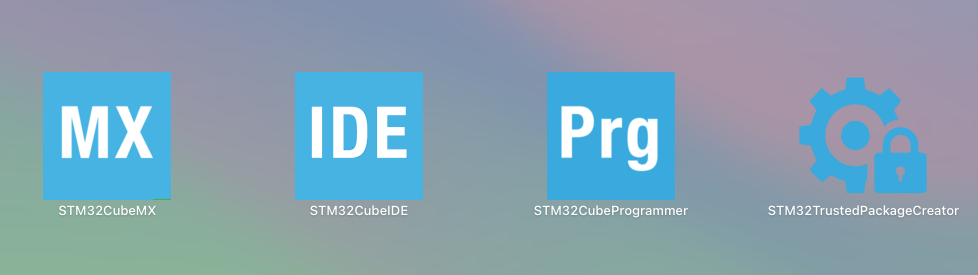
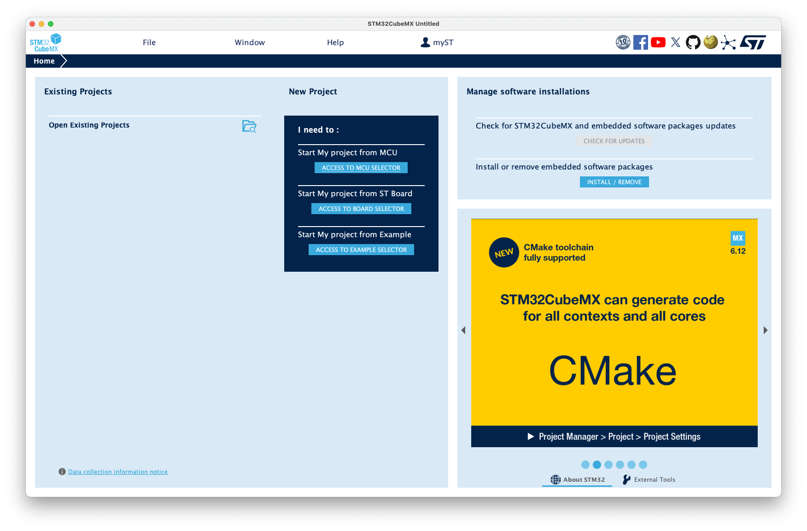
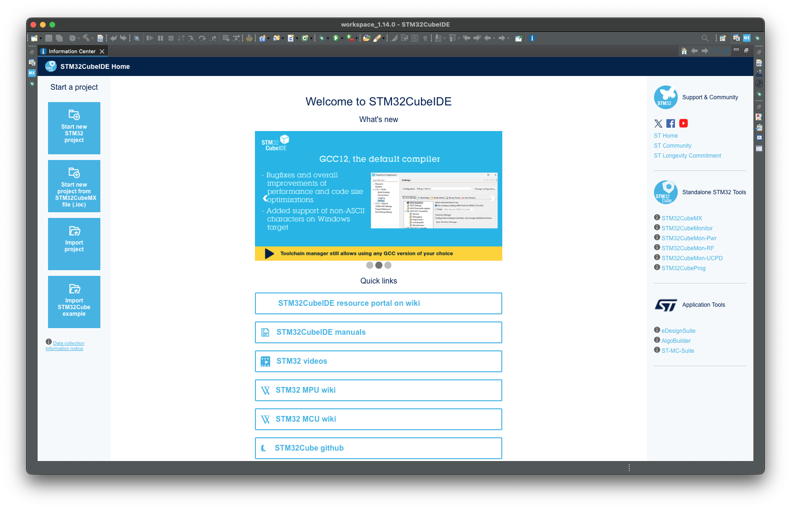
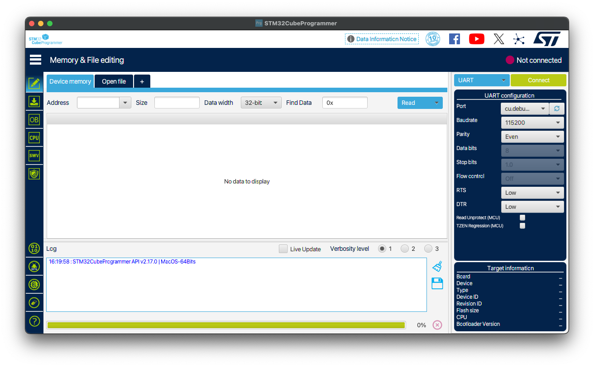
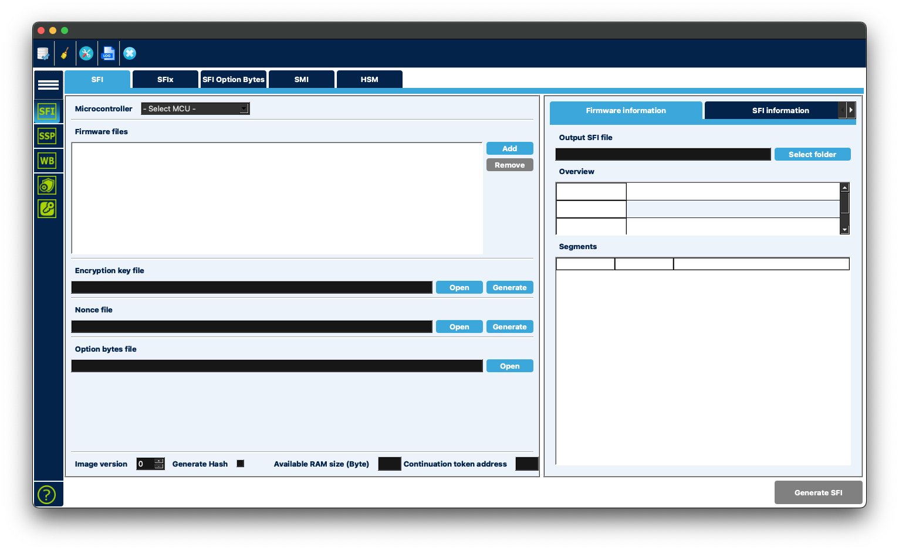

+++
title = "Setup STM tools on Apple Sillicon"
date = 2024-10-06
updated = 2024-10-15
description = "Setup STM tools on Apple Sillicon based MacBook Pro"

[taxonomies]
tags = ["instruction", "tutorial", "STM", "Apple Sillicon", "MacOS", "brew", "STM32"]
+++

## For begining

In this tutorial I collect everything notes about setup STM tools on typical Apple Sillicon based devices (MacBook's includes Pro versions, iMacs, etc)

## Brew

Install JDK, who needs for every STM tools

```zsh
brew install openjdk
```

## STM32

First of all, there are 2 kind of software that we will to install: STM32 Cube MX, IDE and STM32 Cube Programmer with security boot:



### STM32 Cube MX, IDE

This installing is simple, follows the [link](https://www.st.com/en/development-tools/stm32cubeide.html) and download version for MacOS. Do it in automatic mode, no modifications.

After installaction you have two programms:

STM32 Cube MX for graphical setup and design of chip internals


And STM32 Cube IDE for writting code and debug.


### STM32 Cube Programmer, Trusted Package Creator

These two software used for connect to STM32 MPU's like STM32MP157 and others.

The installation is the same as for CubeIDE, follows the [link](https://www.st.com/en/development-tools/stm32cubeprog.html) and download version for MacOS. Also not needed any modifications.

After installaction you also have two programms:

STM32 Cube Programmer


And STM32 Trusted Package Creator


## Final

After installation every tools should to check that everything is working, this will be described in my next publications.
